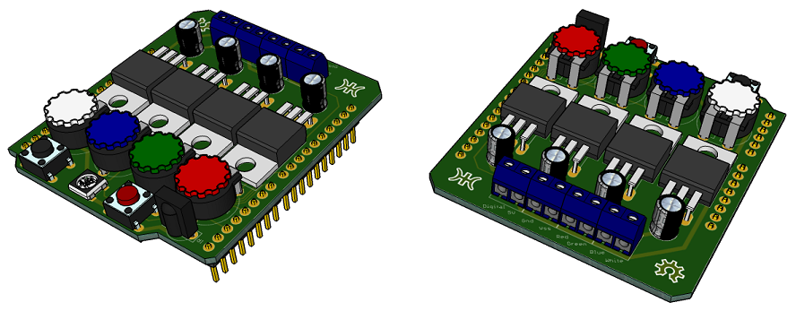

# Hardware Details

This is a brief revision of the hardware.

## Schematic:

## PCB:

## Assembly:

## Conexions:

|  Function  | Pin | 
| :--------- | :-: | 
| Red        |  9  | 
| Green      |  10 | 
| Blue       |  6  | 
| White      |  5  | 
| Digital    |  7  | 
| Button 1   |  8  | 
| Button 2   |  4  |
| IR Reciver |  2  |

## BOM:

| Component                | Quantity    | Price | Total  |
| :----------------------- | :---------: | ----: | -----: |
| Potentiometer 1K         |      4      | 0.80€ |  3.20€ |
| Thumbwheel               |      4      | 0.54€ |  2.16€ |
| IRLB8721                 |      4      | 0.43€ |  1.72€ |
| Capacitator 1µF 50V      |      4      | 0.12€ |  0.48€ |
| SK6812                   |      1      | 0.19€ |  0.19€ | 
| Push Button 0.8 Black    |      1      | 0.59€ |  0.59€ |
| Push Button 0.8 Red      |      1      | 0.96€ |  0.96€ |
| IR Reciver TSOP38238     |      1      | 1.29€ |  1.29€ |
| Pin Header 2.54mm 1x40   |      1      | 0.96€ |  0.96€ | 
| Screw Terminal 3.5mm 1x2 |      4      | 0.58€ |  2.30€ |
| PCB                      |      1      | 0.18€ |  0.18€ |
| Total                    |             |       | 14.03€ |

## License:

This hardware is licensed under OSHW (Open Source Hardware) License.

[:back: Back to Readme](https://github.com/EM-87/RGBW-Analog-Digital-LED-Controller)
