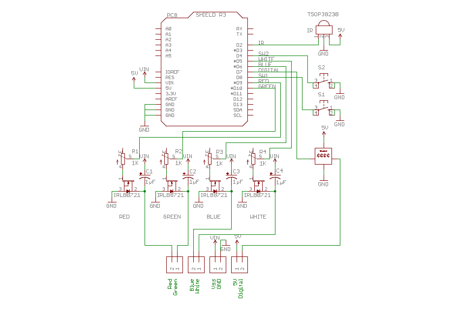

# Hardware Details

This its a brief revision of the hardware.

## Schematic:

## PCB:

## Assembly:

### Conexions:

* Red: 9            
* Green: 10            
* Blue: 6            
* White: 5            
* Digital: 7
* Button 1: 8
* Button 2: 4
* IR Reciver: 2

## BOM:

| Component           | Quantity    | Price |
| ------------------- | :---------: | ----: |
| Potentiometer 1K    | 4           |       |
| IRLB8721            | 4           |       |
| Capacitator 1µF 50V | 4           |       |
| SK6812              | 1           |       |
| Switch              | 2           |       |
| IR Reciver          | 1           |       |
| Pin Header          | 1           |       |
| Screw Terminal 1x2  | 4           |       |
| PCB                 | 1           |       |
| Total               |             |       |

## Author:

* **Eduardo Martínez** - [EM-87](https://github.com/EM-87/)

## License:

This project is licensed under OSHW (Open Source Hardware) License.

[:back: Back to Readme](https://github.com/EM-87/RGBW-Analog-Digital-LED-Controller)
