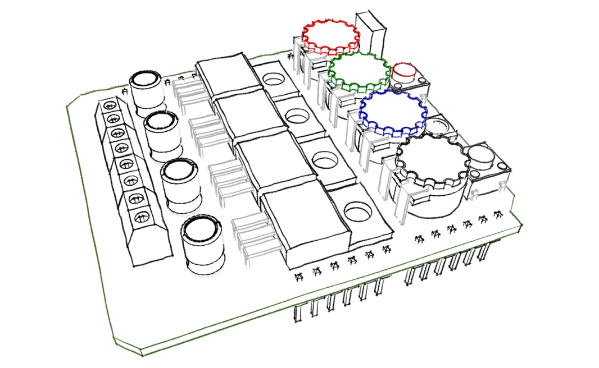

# RGBW Analog/Digital LED Controller
This controller can manage a RGBW analog or digital (SK6812) LED strip whit smooth transitions from an IR controller, USB serial console, or buttons, and got many functions. 

## Functions:
* Smooth color transition
* Power off memory
* 8 Memory colors
* Cycle mode
* IR Reciver
* Serial console
* Console level % input
* Buttons (*On-Off & Modes*)
* Color toggle
* Color dimmer 
* Setteable transition time
* Setteable cycle transition time
* Setteable cycle stay time 
* Setteable cycle dimmer

## Details:
* [Software](./Documentation/Software.md)
* [Hardware](./Documentation/Hardware.md)

#### Credits:

> 2016-2019 Eduardo Martínez
